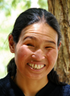

# NPRportrait segmentation

[](https://doi.org/10.5281/zenodo.7852139)

- [Introduction](#introduction)
- [Methodology](#methodology)
- [Usage](#usage)
- [Overview](#overview)
- [License](#license)
- [Citation](#citation)

## Introduction

Style Transfer (ST) algorithms from the field of Non-photorealistic Rendering (NPR) are notoriously hard to compare because there is no objective metric to do so. In a first step, Mould and Rosin introduced the [_NPRgeneral_](https://doi.org/10.1016/j.cag.2017.05.025) dataset, that contains 20 diverse images of various motifs. With it, algorithms can at least be evaluated on set of standard images rather than every author picking their own and, unwillingly or not, introduce even more subjective bias in the comparison. As a follow-up Rosin et al. later also introduced the [_NPRportrait_](https://dl.acm.org/doi/10.1145/3092919.3092921) dataset, that, as the name implies, only contains portraits. In 2022 Rosin et al. released an [updated version](https://doi.org/10.1007/s41095-021-0255-3), dubbing the initial version [_0.1_](https://github.com/pystiche/NPRportrait-segmentation#nprportrait-01) and the new one [_1.0_](https://github.com/pystiche/NPRportrait-segmentation#nprportrait-10). Both datasets use a leveled approach, in which each level includes 20 images that increase in difficulty, e.g. partially or fully covered facial features. _0.1_ comes with two and _1.0_ with three levels.

ST algorithms, e.g. Neural Style Transfer (NST) algorithms, can be applied to an image as is. However, if the image exhibits stark differences between multiple regions, e.g. different facial features, this often leads to artifacts. To avoid this without painstakingly and manually fine-tuning the hyperparameters of an algorithm that should automate the task at hand, one can also guide the algorithm using segmentation masks of the image. Albeit not for portraits, this technique was recently used by [Gatys et al.](https://doi.org/10.1109/CVPR.2017.397) to improve the results of their NST algorithm and even being able to mix different styles in the stylized image per region.

Unfortunately, so far there are no segmentation masks available for the standard datasets detailed above. As the name implies _NPRportrait-segmentation_ fills this gap for the portrait benchmark datasets.

## Methodology

There are a number of datasets out there that provide segmentation masks for portraits, e.g. [FASSEG](http://massimomauro.github.io/FASSEG-repository/) or [CelebAMask-HQ](https://github.com/switchablenorms/CelebAMask-HQ). However, they are often suboptimal for ST algorithms:

1. Some datasets are too coarse and lump features like the lips and teeth together in one region, although they have vastly different styles.
2. Some datasets are too fine-grained and differentiate between left and right facial features, although this has no impact on the ST.

For _NPRportrait-segmentation_ we settled on 14 different regions excluding the background that we found the most important ones during our research:

- skin
- clothing
- eyeballs
- nose
- ears
- hair
- eyebrows
- facial hair
- lips
- teeth
- mouth cavity
- accessories
- headgear
- glasses

Due to the fine division, a coarser division of the regions is possible at any time by merging the masks. This makes these segmentations usable for various applications.

The segmentations for all 100 images were manually created. Apart from the inherent annotation bias, it was difficult in some images to introduce a clear cut between the _hair_ and _background_ region (cf. Figure 1). We opted to only label a region as _hair_ if there is a significant hair density, with no intention to make "significant" more concrete.

|    |
|:--------------------------------------------------------------------------------------------------------------------------------------------------------------------------------------------------------------------------------------------:| 
|     Figure 1: An image (left), its corresponding segmentation (middle), and the segmentation without background (right). Areas of low hair density were not annotated as belonging to the _hair_, but rather to the _background_ region.     |

## Usage

_NPRportrait-segmentation_ provides the segmentation in two formats:

1. As a single segmentation image which separates the regions by colour. The color map is detailed below. You can find these images inside the `segmentations/` directory.
2. As multiple boolean masks per image where each mask is white for the respective region and black everywhere else. You can find these images inside the `masks/` directory.

### Colormap

| region                                                                                                          | RGB code          |
|-----------------------------------------------------------------------------------------------------------------|-------------------|
| [](https://colornames.org/color/000000)     | `(  0,   0,   0)` |
| [](https://colornames.org/color/3182bd)                 | `( 49, 130, 189)` |
| [](https://colornames.org/color/6baed6)         | `(107, 174, 214)` |
| [](https://colornames.org/color/e6550d)         | `(230,  85,  13)` |
| [](https://colornames.org/color/fd8d3c)                 | `(253, 141,  60)` |
| [](https://colornames.org/color/fdae6b)                 | `(253, 174, 107)` |
| [](https://colornames.org/color/31a354)                 | `( 49, 163,  84)` |
| [](https://colornames.org/color/74c476)         | `(116, 196, 118)` |
| [](https://colornames.org/color/a1d99b)   | `(161, 217, 155)` |
| [](https://colornames.org/color/756bb1)                 | `(117, 107, 177)` |
| [](https://colornames.org/color/9e9ac8)               | `(158, 154, 200)` |
| [](https://colornames.org/color/bcbddc) | `(188, 189, 220)` |
| [](https://colornames.org/color/636363)   | `( 99,  99,  99)` |
| [](https://colornames.org/color/969696)         | `(150, 150, 150)` |
| [](https://colornames.org/color/bdbdbd)           | `(189, 189, 189)` |

### Region distribution

|                                                                                                                                                            |
|:-----------------------------------------------------------------------------------------------------------------------------------------------------------------------------------------------------------------:|
| Figure 2: Distribution of regions throughout _NPRportrait-segmentation_. The regions _background_, _skin_, _nose_, and _lips_ are not shown since they are present in every image regardless of version or level. |

## Overview

### Version v0.1

#### Level 1

       

       

       

       

       


#### Level 2

       

       

       

       

       


### Version v1.0

#### Level 1

       

       

       

       

       


#### Level 2

       

       

       

       

       


#### Level 3

       

       

       

       

       

## License
The Creative Commons Attribution 4.0 International License applies solely to the segmentation images that we have created. It does not apply to any third-party data or information that we may have used in the creation of our segmentation. We make no claims or guarantees regarding the accuracy, completeness, or legality of any third-party data or information that may have been used in our data, and we disclaim any liability for any damages or losses that may result from the use or reliance on such third-party data or information.

## Citation

If you use the _NPRportrait-segmentation_ dataset provided in this repository, please cite it as below:

```bibtex
@misc{Bultemeier_NPRportrait-segmentation,
  author = {Bültemeier, Julian and Meier, Philip and Lohweg, Volker},
  doi    = {10.5281/zenodo.7852139},
  title  = {{NPRportrait-segmentation}},
  url    = {https://github.com/pystiche/NPRportrait-segmentation}
}
```

Please don't forget to cite the original work by Rosin et al. as well:

### [_NPRportrait 0.1_](https://dl.acm.org/doi/10.1145/3092919.3092921)

```bibtex
@inproceedings{10.1145/3092919.3092921,
  author     = {Rosin, Paul L. and Mould, David and Berger, Itamar and Collomosse, John and Lai, Yu-Kun and Li, Chuan and Li, Hua and Shamir, Ariel and Wand, Michael and Wang, Tinghuai and Winnem\"{o}ller, Holger},
  title      = {Benchmarking Non-Photorealistic Rendering of Portraits},
  year       = {2017},
  isbn       = {9781450350815},
  publisher  = {Association for Computing Machinery},
  address    = {New York, NY, USA},
  url        = {https://doi.org/10.1145/3092919.3092921},
  doi        = {10.1145/3092919.3092921},
  abstract   = {We present a set of images for helping NPR practitioners evaluate their image-based portrait stylisation algorithms. Using a standard set both facilitates comparisons with other methods and helps ensure that presented results are representative. We give two levels of difficulty, each consisting of 20 images selected systematically so as to provide good coverage of several possible portrait characteristics. We applied three existing portrait-specific stylisation algorithms, two general-purpose stylisation algorithms, and one general learning based stylisation algorithm to the first level of the benchmark, corresponding to the type of constrained images that have often been used in portrait-specific work. We found that the existing methods are generally effective on this new image set, demonstrating that level one of the benchmark is tractable; challenges remain at level two. Results revealed several advantages conferred by portrait-specific algorithms over general-purpose algorithms: portrait-specific algorithms can use domain-specific information to preserve key details such as eyes and to eliminate extraneous details, and they have more scope for semantically meaningful abstraction due to the underlying face model. Finally, we provide some thoughts on systematically extending the benchmark to higher levels of difficulty.},
  booktitle  = {Proceedings of the Symposium on Non-Photorealistic Animation and Rendering},
  articleno  = {11},
  numpages   = {12},
  keywords   = {image stylisation, evaluation, portraits, non-photorealistic rendering},
  location   = {Los Angeles, California},
  series     = {NPAR '17},
}
```

### [_NPRportrait 1.0_](https://doi.org/10.1007/s41095-021-0255-3)

```bibtex
@article{Rosin2022,
  title    = {NPRportrait 1.0: A three-level benchmark for non-photorealistic rendering of portraits},
  author   = {Rosin, Paul L and Lai, Yu-Kun and Mould, David and Yi, Ran and Berger, Itamar and Doyle, Lars and Lee, Seungyong and Li, Chuan and Liu, Yong-Jin and Semmo, Amir and others},
  journal  = {Computational Visual Media},
  volume   = {8},
  number   = {3},
  pages    = {445--465},
  year     = {2022},
  abstract = {Recently, there has been an upsurge of activity in image-based non-photorealistic rendering (NPR), and in particular portrait image stylisation, due to the advent of neural style transfer (NST). However, the state of performance evaluation in this field is poor, especially compared to the norms in the computer vision and machine learning communities. Unfortunately, the task of evaluating image stylisation is thus far not well defined, since it involves subjective, perceptual, and aesthetic aspects. To make progress towards a solution, this paper proposes a new structured, three-level, benchmark dataset for the evaluation of stylised portrait images. Rigorous criteria were used for its construction, and its consistency was validated by user studies. Moreover, a new methodology has been developed for evaluating portrait stylisation algorithms, which makes use of the different benchmark levels as well as annotations provided by user studies regarding the characteristics of the faces. We perform evaluation for a wide variety of image stylisation methods (both portrait-specific and general purpose, and also both traditional NPR approaches and NST) using the new benchmark dataset.},
  url      = {https://doi.org/10.1007/s41095-021-0255-3},
  doi      = {10.1007/s41095-021-0255-3},
}
```
